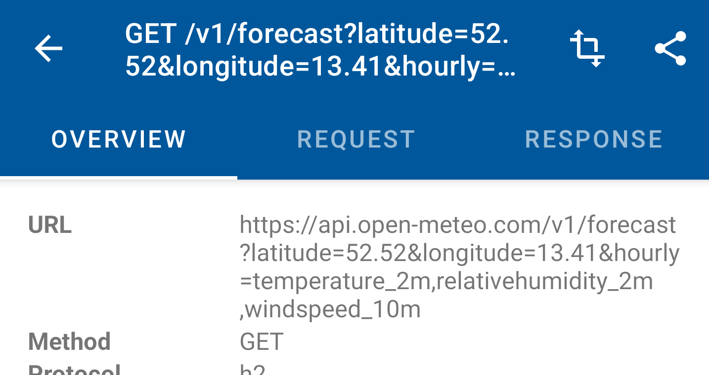

# KashProxy
       [](http://makeapullrequest.com)

_An enhanced fork of [Chucker](https://github.com/ChuckerTeam/chucker)_

<br/><br/>
<p align="center">
  
</p>

<br/>


## What is KashProxy?
KashProxy is born from a thought to have the Charles Proxy within the application to make life of developers and testers easier.

KashProxy simplifies the process of mocking of **HTTP(S) requests/responses** fired by your Android App. KashProxy works as an **OkHttp Interceptor**, and will provide the required response for the URLs you configured in the KashProxy Mapping List. It provides the required UI for create mapping for each API URL.

KashProxy also integrate the famous Network Monitoring library [Chucker](https://github.com/ChuckerTeam/chucker) in it, in order to make the mapping of URL more easier and effortless. The app will bring all the features of [Chucker](https://github.com/ChuckerTeam/chucker) too, providing easy extension functions to set up [Chucker](https://github.com/ChuckerTeam/chucker) and KashProxy.

Apps using KashProxy will display a **notification** showing a summary of ongoing HTTP response mappings. Tapping on the notification launches the full KashProxy UI. Apps can optionally suppress the notification, and launch the KashProxy UI and [Chucker](https://github.com/ChuckerTeam/chucker) directly from within their own interface.


* [Getting Started](#getting-started-)
* [Acknowledgments](#acknowledgments-)
* [License](#license-)


## Getting Started 👣


####Adding Dependencies

KashProxy is distributed through [Maven Central](https://search.maven.org/artifact/com.github.appspiriment.kashproxy/library). To use it you need to add the following **Gradle dependency** to the `build.gradle` files

In the root project `build.gradle` file, add this in the android block:

 ```groovy
	ext {
        kashProxyVersion = '1.0.1'
 	}
 ```

Now, in your android app module `build.gradle` (NOT the root project `build.gradle` file), add the below dependencies

```groovy
dependencies {
  debugImplementation "io.github.appspirimentlabs:kashproxy-library:$kashProxyVersion"
  releaseImplementation "io.github.appspirimentlabs:kashproxy-library-no-op:$kashProxyVersion"
}
```

Please note that you should add both the `library` and the `library-no-op` variant to isolate KashProxy & Chucker from release builds as follows:


####Adding Interceptor

In order to record your API transactions, and to map the responses, you need to add the interceptor to the OkHttpClient.

For that, just plug in a new `ChuckerInterceptor` to your OkHttp Client Builder like this:

```kotlin
val client = OkHttpClient.Builder()
                .addInterceptor(KashProxy.getInterceptor(context))
                .build()
```

[Enable Java 8 support](https://developer.android.com/studio/write/java8-support).

```groovy
android {
  compileOptions {
    sourceCompatibility JavaVersion.VERSION_1_8
    targetCompatibility JavaVersion.VERSION_1_8
  }

  // For Kotlin projects add also this line
  kotlinOptions.jvmTarget = "1.8"
}
```

### Configure Chucker🎨

You can customize chucker providing an instance of a `ChuckerCollector`. For configuring Chucker, please take a look at Chucker implementation guide: [Chucker Configuration](https://github.com/ChuckerTeam/chucker#configure-)

**That's it!** 🎉 Chucker will now record all HTTP interactions made by your OkHttp client, and once you set up your required mappings, KashProxy will map your responses as per your wish!

## Features 🧰

As KashProxy is a port of Chucker itself, it also inherits many of Chucker's features too.

For Chucker features take a peek here : [Chucker Features](https://github.com/ChuckerTeam/chucker#features-)


## Creating Mappings


#### Mapping from Chucker Log

You can create a response mapping directly from the Chucker log, which is the most recommended way to mock the response of a particular API. This will cover most of the common usecases, as the APIs will mostly be pre-defined.

For creating a map, just open the required api and click on the Transform menu in the actionbar. this will open the Mapping Editor, in which you can edit the required fields, including the success and error response.

<p align="center">
  
</p>


The library will use the matching-from-start method, which means, if you create a map for `https://google.com`, it will also match `https://google.com/search?query=xys`.


## Limitations

KashProxy currently supports exact URL matching only. This means, you have to give the exact url, with all the query parameters in correct order too. And, unfortunately there is not wildcard support. We know these are serious limitations, but as we are working hard to provide more sophisticated matching algorithm just like Charles Proxy. And we are working to include the Break-Point mechanism too..


## Acknowledgments 🌸

#### Maintainers

KashProxy is currently developed and maintained by [Arun Shankar](https://github.com/arunkarshan). When submitting a new PR, please ping:

- [@arunkarshan](https://github.com/arunkarshan)


#### Thanks

Big thanks to the Chucker Team ❤️ for the code and the  ReadMe 😍


#### Libraries

KashProxy uses the following open source libraries:

- [Chucker](https://github.com/ChuckerTeam/chucker) - Copyright 2018-2021 Chucker Team.
- [OkHttp](https://github.com/square/okhttp) - Copyright Square, Inc.
- [Gson](https://github.com/google/gson) - Copyright Google Inc.
- [Room](https://developer.android.com/topic/libraries/architecture/room) - Copyright Google Inc.


## Sponsors 💸

KashProxy is maintained by a voluntary team, but we won't be able to do this if there was no Chucker!

Chucker is maintained and improved during nights, weekends and whenever Chucker team has free time. If you use Chucker or KashProxy in your project, please consider sponsoring the ChuckerTeam. This will help them buy a domain for a website they will have soon and also spend some money on charity. Additionally, sponsorship will also help them understand better how valuable Chucker is for people's everyday work.

You can sponsor them by clicking `Sponsor` button on [Chucker](https://github.com/ChuckerTeam/) page.


## License 📄

```
    Copyright (C) 2022 Arun Shankar.

    Licensed under the Apache License, Version 2.0 (the "License");
    you may not use this file except in compliance with the License.
    You may obtain a copy of the License at

    http://www.apache.org/licenses/LICENSE-2.0

    Unless required by applicable law or agreed to in writing, software
    distributed under the License is distributed on an "AS IS" BASIS,
    WITHOUT WARRANTIES OR CONDITIONS OF ANY KIND, either express or implied.
    See the License for the specific language governing permissions and
    limitations under the License.
```
